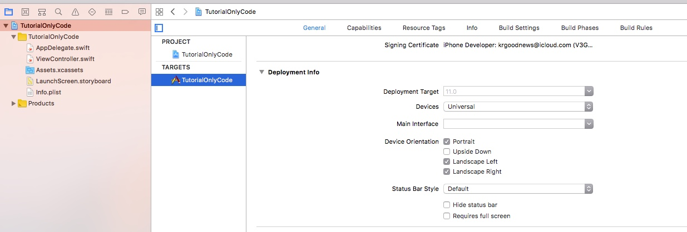

## 1. AppDelegate.swift 편집 (필수)
**앱 실행시 LaunchScreen을 지나 처음으로 실행되는 ViewController를 지정한다.**
스토리보드를 사용한다면 [Main.storyboard의 Initial View Controller를 정하는 작업]이다.

```swift
	func application(_ application: UIApplication, didFinishLaunchingWithOptions launchOptions: [UIApplicationLaunchOptionsKey: Any]?) -> Bool {
		
		window = UIWindow()
		window?.makeKeyAndVisible()
		window?.rootViewController = ViewController()
		
		return true
	}
```

**끝났다.** 이제 앱을 실행하면 설정되어있는 스토리보드를 무시하고 ViewController()를 실행할 것이다.
스토리보드를 병행할 수 없는건 아니다. 코드로 작업하면서도 얼마든지 스토리보드를 이용할 수 있다.
아래 작업부터는 선택사항이니 수행하지 않아도 결과는 달라지지 않는다. 하지만 프로젝트가 조금 더 깔끔해진다.

## 2. Main Interface 변경
**[Project name] - TARGETS - General - Deployment Info - Main Interface를 빈칸으로 놔둔다.** 


## 3. Main.storyboard 삭제
온리코드로 작업할 예정이라면 삭제해도 좋다. LaunchScreen.storyboard는 삭제하지 마라.

## 4. ViewController.swift 간소화

```swift
import UIKit

class ViewController: UIViewController {

	override func viewDidLoad() {
		super.viewDidLoad()

	}
}
```