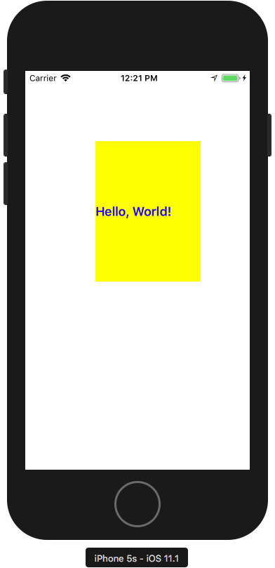

# UILabel

## 목표: UILabel을 선언하고,  ViewController에 띄운다.


<br>

## Recipe
### 1. ViewController에 UILabel을 선언한다.

```swift
class ViewController: UIViewController {
	let firstLabel: UILabel = {
		let label = UILabel()
		// 속성 지정
		label.text = "Hello, World!"
		label.backgroundColor = .yellow
		label.font = .boldSystemFont(ofSize: 32)
		label.textColor = .blue
		return label
	}()
```
<br><br>

### 2. ViewDidLoad 안에 firstLabel을 추가하고, 프레임을 지정한다.

```swift
	override func viewDidLoad() {
		super.viewDidLoad()
		
		// view.backgroundColor을 지정하지 않으면 뷰가 까맣게 나온다. 사실은 투명한거지만 나중에 설명하겠다.
		view.backgroundColor = .white
		
		// ViewController의 View 안에 Label을 더한다.
		view.addSubview(firstLabel) 
		
		// frame을 지정한다. 추후에 AutoLayout을 적용해 깔끔하게 넣는 법을 알려주겠다.
		firstLabel.frame = CGRect(x: 100, y: 100, width: 300, height: 200)
	} 
```
<br><br>

### 3. 끝났다. 참 쉽죠?


